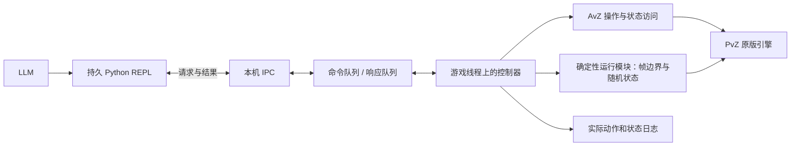

# LLM 交互控制：常驻适配器与 Python REPL

状态：设计提案，尚未实现 IPC 服务或客户端。基于现有项目骨架及 AvZ 提交 `c42676c269b5b482a1eb9203a5b979e9d8a2a5c7` 的源码核查，日期 2026-09-18。

## 1. 推荐结构

**编译一次 C++ 适配器，让它常驻 PvZ；LLM 使用持久 Python 会话，实时发送结构化命令。** 普通决策不触发 C++ 编译，也不重新注入 DLL。



编译的内容是接口与原生能力，解释执行的内容是策略。LLM 可以随时修改 Python 的变量、函数、循环和判断，再调用同一套接口。只有新增一个原生操作或修改 hook 时，才重编译并开始一个使用新构建的实验。

当前已有 `lvz::Plant`、`lvz::Shovel` 和 logger，适合作为动作执行层的起点；它们目前没有远程调用入口，也没有提供经过验证的逐帧调度器。

## 2. 模型看到的拟议 API

以下是接口示意，不是现有可运行代码：

```python
game = connect(session="trial-ready")
obs = game.observe()                    # 保持在可操作边界

result = game.commit(
    expect=obs.version,                 # epoch / tick / revision
    actions=[plant("PUFF_SHROOM", row=2, col=5)],
    advance_ticks=1,
)
obs = result.observation                # 完成实际一步后返回，并保持暂停

result = game.advance(
    max_ticks=50,
    until={"event": "wave_changed"},   # 服务端已支持的有限条件
)
```

`until` 的关键事件会在游戏线程逐帧检查，不需要每帧调用 LLM。复杂临时判断可以在持久 Python 会话中写循环；它仍须通过明确的观察与推进接口访问游戏。

不可把普通 Python lambda 当成自动在 C++ 内执行的谓词。需要服务端高频判定时，先定义小而明确的条件协议，例如波次变化、指定实体状态变化或某张卡恢复，给出最大帧数和最大事件数。

推荐第一批操作：

| 操作 | 语义 |
|---|---|
| `hello/capabilities` | 返回游戏构建、适配器构建、协议版本和已验证能力 |
| `observe` | 在同一个稳定边界生成一致的观察，不推进模拟 |
| `commit` | 校验观察版本，按顺序执行一批动作，再推进指定步数 |
| `advance` | 最多推进 N 个实际模拟步，可在约定事件出现时提前停止 |
| `pause/status` | 在下一个稳定边界停止；查询状态或未完成请求 |
| `cancel` | 请求在下一个稳定边界结束长推进，返回实际已执行范围 |
| `checkpoint/restore` | 只有完成状态完整性验证后才声明支持；首版返回不支持 |

`commit` 的动作按顺序执行，默认遇到失败就停止后续动作，并跳过本次推进；此前已成功的操作不会自动回滚。响应必须逐条列出结果。动作改变局面后即使 `advance_ticks=0`，观察 revision 也必须更新，因为游戏内容可能已改变而 GameClock 未变。

## 3. 为什么这仍然是真正可编程的 REPL

模型可以在 Python 中写：

```python
# 拟议客户端示例
def inspect_threats(obs):
    return sorted(obs.zombies, key=lambda z: z.x)

threats = inspect_threats(game.observe())
```

Python 保存会话变量、计划与辅助函数；C++ 只执行已约定的游戏操作。64 位 Python 和 32 位 PvZ 通过消息通信，无须共享指针或直接匹配 ABI。

对于已经写好的长轨道，可以扩展 `schedule`：上传有限数量的动作、相对游戏帧和前置条件。调度使用模拟时间，执行结果进入同一份动作日志。首版无需嵌入 Python/Lua 到游戏进程，也无需对每段 LLM 输出调用 clang。

## 4. IPC 与游戏线程分工

Windows 首选仅本机使用的命名管道；采用明确长度的 UTF-8 JSON 消息。配置拒绝远程客户端，避免默认命名管道意外成为跨机器接口。未来如果需要 Linux 或远程宿主，可在外部客户端层替换通信方式。

通信线程只负责读取、校验消息、排队和返回结果。它不能调用 `ACard`、修改植物、读取正在变化的对象数组，或把游戏对象指针带出游戏线程。

游戏线程在已知边界：

1. 取得一个完整请求，检查 session、epoch、观察版本和当前状态。
2. 执行动作；复制实际结果和稳定状态，生成不可变响应。
3. 根据预算推进模拟，检测终止条件。
4. 回到暂停边界后提交响应；通信线程发送给 Python。

等待 LLM 时，窗口消息处理与 IPC 继续运行，模拟步预算为 0。不能在游戏线程做阻塞 `ReadFile`，否则窗口和请求处理都可能卡死。命名管道可以使用 overlapped I/O，也可以由独立通信线程处理阻塞操作；两者都不能把等待搬到模拟线程。[Windows Named Pipes](https://learn.microsoft.com/en-us/windows/win32/ipc/named-pipes)、[同步与异步管道 I/O](https://learn.microsoft.com/en-us/windows/win32/ipc/synchronous-and-overlapped-input-and-output)

## 5. 精确推进需要专门实现

当前源码能确认：

- `BeforeTick/AfterTick` 围绕的是 AvZ 主体代码，不是原版模拟更新。
- `ScriptHook()` 先运行 `RunTotal()`，再调用 `GameTotalLoop()`。
- 跳帧路径又使用 `RunTotal()`、`GameFightLoop()`、对象清理和退出检查，不能假定它与普通窗口更新是完全相同的路径。
- 高级暂停下，普通战斗调度不会继续运行，`GLOBAL` 帧运行及外层钩子仍可执行。

因此不能直接把 `AfterTick` 响应命名为 post-step，也不能在任意回调里递归调用 `GameTotalLoop()` 来实现 `advance(1)`。[主循环](https://github.com/vector-wlc/AsmVsZombies/blob/c42676c269b5b482a1eb9203a5b979e9d8a2a5c7/src/avz_script.cpp)、[钩子定义](https://github.com/vector-wlc/AsmVsZombies/blob/c42676c269b5b482a1eb9203a5b979e9d8a2a5c7/inc/avz_state_hook.h)

建议先在常规运行路径中验证“下一次模拟更新前”的边界：在那里观察上一步已完成的局面，决定是否允许下一步。若这一边界不能覆盖内部多次更新、清理或退出，则由确定性运行模块补充更准确的入口／出口 hook。该模块与 AvZ 的主循环、暂停补丁必须有唯一所有者，不能各写一套互相覆盖。

控制状态机建议为：

```text
DETACHED → INITIALIZING → PAUSED_AT_BOUNDARY
                           ↓  commit / advance
                         STEPPING
                           ↓  达到预算、事件、退出或错误
                       PAUSED_AT_BOUNDARY / TERMINAL / ERROR
```

返回值必须同时包含 requested_ticks、executed_ticks、停止原因、动作结果和最终观察版本。游戏失败、进入选卡或进程退出都可能导致提前返回；不能伪造“已推进 N 帧”。

## 6. 请求身份与重试

请求示意：

```json
{
  "protocol": 1,
  "session": "trial-ready",
  "epoch": 2,
  "request_id": "decision-0042",
  "expect": {"tick": 12340, "revision": 8},
  "method": "commit",
  "params": {
    "actions": [{"op": "plant", "type": 8, "row": 2, "col": 5}],
    "advance_ticks": 1
  }
}
```

- `epoch` 在重开、读档或切换时间分支时改变；拒绝旧 epoch 的指令。
- `revision` 区分同帧不同操作后的局面，拒绝基于旧观察的命令。
- 同 session/epoch/request_id 且请求体一致的重试，返回已有结果；同 ID 不同内容报错。
- 收到命令只表示 accepted；Python 同步方法默认等待 completed，不能把入队当种植成功。
- 丢连接后按 request_id 查询完成状态，不默认重新执行种植。
- 进程崩溃后建立新 epoch，不声称靠内存中的响应缓存实现了跨崩溃“恰好一次”。

消息的到达墙钟时间不决定游戏执行帧。有效执行序列由 epoch、模拟边界、帧内序号和请求 ID 决定。

## 7. 与 logger / replay 的关系

同一个命令执行器服务三类输入：LLM、人工脚本和重放文件。执行路径和动作语义保持一致，只替换指令来源。重放时不调用 LLM，也不恢复 Python 会话才能继续放原轨迹。

要从中途分支继续让同一个 Python 策略运行，则还需要策略状态：显式序列化策略变量，或从初始记录重新构建客户端状态。游戏快照不包含外部 Python REPL 内存。

最少应保存：

- 模型实际收到的观察与版本号，模型请求、返回和代码单元；
- accepted/completed 或失败记录、执行帧、帧内顺序、每个动作的实际结果；
- 模拟步数、提前停止原因、状态摘要；
- 控制器、DLL、协议和配置的版本；
- 若允许回档，父分支、分叉位置与被取消的命令。

当前 logger 的 `avz_callback` 记录可继续用于诊断；正式 post-step 观察应在完成边界验证后增加明确的新相位，不能直接重新命名旧数据。

## 8. 开发顺序与验收

1. **常驻连接**：实现 hello/observe；同一暂停局面重复读取，观察版本和游戏时钟不变。
2. **动作入口**：接通 Plant/Shovel，记录成功、非法落点、冷却不足、旧观察拒绝及重复请求。
3. **单步控制**：循环 100 次 `advance(1)` 与一次 `advance(100)` 比较实际更新次数及状态轨迹；用独立边界计数，不仅看回调次数。
4. **思考时间隔离**：在相同边界分别等待短时间、长时间后执行同一动作，比较后续模拟与 RNG 轨迹。不能只检查暂停期间画面不动。
5. **长推进与重连**：波次/失败时提前停止，测试断连后查询、取消和无重复执行。
6. **共用重放路径**：从同一已验证初态执行已记录动作，逐步对比分叉；随机状态与快照能力按重放器提案补齐。

本阶段只输出设计文档；现有 `recorder.dll` 仍是记录器，没有因此获得 REPL 或确定性步进能力。

对应的原版引擎重放、随机源与快照方案见[原版确定性重放器提案](原版确定性重放器提案.md)。
