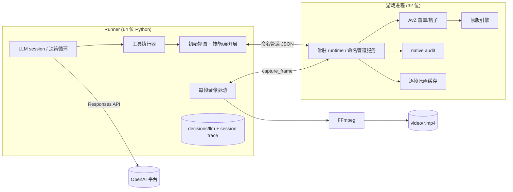

# LLM 对局 MVP 定义

Feature：`llm-match-mvp`（建议分支 `feat/llm-match-mvp`）。状态：**定义，尚未实现**。日期：2026-09-20。基线：`bd4b7a4`。

修订 2026-09-22：控制粒度改为**严格逐帧 + 显式 skip**；放弃默认的判断式过滤，改为**技能式渐进展开**；§8 的 MCP 口径按"本机 MCP server + 本机 client"重写。

[LLM 交互控制设计](LLM交互控制设计.md) 定义"接口长什么样"；本文件定义"用这套接口做出的第一个完整可交付对局是什么"，并把需要拍板的点写成可评审结论。标注 **[建议]** 的是默认取舍，可直接采纳；标注 **[待定]** 的项需要用户确认后再进代码。

## 0. 一句话定义

一个 LLM（OpenAI Responses API，单个 session）通过常驻 AvZ runtime 的本机命名管道，在**受控帧边界**上观察和操作真实原版 PvZ，走完一次雾夜两仪对局；全程每 tick 录一帧画面并产出视频，模型输入输出与动作全部结构化留档，游戏失败时自动停止推进、停录并封档。

## 1. MVP 的成功判据

一次真实对局同时满足以下五条，才算 MVP 通过（缺一条即未通过，不得降级表述）：

1. **只用 AvZ 控制反馈管线**：模型的全部感知来自 runtime 的 `observe` 与查询工具，全部写入经 `commit`/`advance`；没有任何窗口消息、键鼠注入、桌面截图、`PrintWindow` 或直接内存访问参与决策与操作。
2. **严格逐帧受控**：控制粒度永远是 1 tick，任何推进都是单 tick 受控更新的循环；模型思考期间游戏停在稳定边界，墙钟不驱动模拟。允许 **skip**，但 skip 只是"连续多个单 tick 更新期间不调用模型"，不是让模拟一次跨过若干 tick；每个 tick 仍有独立的边界审计与录像帧。
3. **每帧录像**：视频采样步长 `tick_stride = 1`，帧映射逐帧可查，视频可用 `ffprobe` 解码，覆盖到终局（不是抽查片段）。
4. **完整 LLM 记录**：模型实际看到的摘要、每次工具调用与结果、每个 RPC 的 request_id、动作结果、token 用量、模型与提示版本全部落盘，事后可独立复核"模型知道什么、做了什么"。
5. **失败自动停止**：终局（GameOver/场景切换）或不可恢复错误发生时，自动停止推进、关录、封档，并写出 `outcome`；不允许把未发生的推进写成"已推进 N tick"。

对照目标：同一场景下 `examples/liangyi_baseline.py` 基准策略的调度意图是参照物，不是逐动作必须相同的模板。MVP 先以**完成单旗（前 10 波）不失败**为第一里程碑，再以**完整两旗**为最终里程碑。

## 2. 非目标

MVP 明确不做，也不留模糊空间：

- 不做读档、回滚、搜索、分支重试。反复读档会刷新不入档的全局 MT，等于重掷出怪行与掉落，是 [阵型运转影响评估](阵型运转影响评估.md) §6 列出的"存档刷"入口。
- 不做 checkpoint/restore（runtime 现在明确返回不支持），不声称可从中途恢复。
- 不加速、不跳帧、不用墙钟换模拟步数。
- 不把 RNG 内部状态（MT 表、游标、CRT 状态）暴露给模型。审计读到它是**只读证据**，不是 agent 接口。
- 不在默认上下文里放 Runner 的判断式过滤结论：不替模型决定"哪些僵尸不需要管"；初始视图只做压缩与计数，全部原始细节随时可展开（§7）。
- 不做多局并行、多 agent、多模型投票、微调、训练。
- 不做纯无窗口/无桌面会话（当前 `headless` 含义是隐藏窗口，不是无渲染）。
- 不做性能承诺。所有预算数字在 F8 实测前都标注为估计。

## 3. 已具备与待新建

| 能力 | 现状 | 入口 |
|---|---|---|
| 常驻 AvZ runtime + 本机命名管道 | 已实现，真实集成验收通过 | [runtime-protocol.md](runtime-protocol.md) |
| `observe` / `commit` / `advance` / `pause` / `cancel` / `status` | 已实现 | 同上 |
| 精确帧边界、epoch/revision、请求去重与恢复 | 已实现 | 同上 |
| 原画逐帧缓存（每个受控更新一次绘制与读取） | 已实现，1,000 tick 录像对照通过 | [video.md](video.md) |
| `capture_frame` RPC（BGR24，仅拷贝缓存） | 已实现 | 同上 |
| `StreamingVideo` + `TickRecorder` + 帧映射 | 已实现 | 同上 |
| 原生审计（pre/post 边界、状态差分、旁证） | 已实现 | [determinism.md](determinism.md) |
| 启动器、用户档隔离、场景初始化、评测入口 | 已实现 | [launcher.md](launcher.md)、[evaluation.md](evaluation.md) |
| 常驻 Python 策略 REPL 与 SessionTrace | 已实现（人工/脚本驱动） | [client.md](client.md) |
| **LLM session runner（决策循环、工具层、自动停录）** | **待新建** | 本文件 |
| **OpenAI Responses 客户端（鉴权、用量、重试幂等）** | **待新建** | §9 |
| **初始视图 + 技能/展开层（渐进展开）** | **待新建** | §7 |
| **LLM 事件的独立日志（`decisions/llm/`）** | **待新建** | §10 |
| **状态数据库（游戏线程边界记录的物化视图）** | **待新建，MVP-1 候选** | §7.8 |

MVP 的代码量主要集中在 runner，不改 AvZ 与确定性模块；唯一可能需要的小改动是往 `observe` 增加少量只读字段（见 §11.1），其他都靠派生层解决。

## 4. 架构与进程职责



职责边界：

| 组件 | 只做 | 绝不做 |
|---|---|---|
| runtime（游戏线程） | 在稳定边界观察、执行已协商动作、推进帧预算、写审计 | 阻塞读管道、执行模型文本、暴露对象指针 |
| Runner 决策循环 | 组装模型输入、调用模型、调度工具、推进游戏、判定终局 | 绕过 runtime 直接改游戏、把 RNG 交给模型 |
| Runner 录像驱动 | 在每个完成边界取缓存帧、送 FFmpeg、写帧映射 | 自己推进游戏、用桌面截图代替原画 |
| 模型 | 在工具清单内决策 | 选择模型之外的动作、跳过审计路径 |

只有 runtime 能读游戏对象；Runner 与模型都只看到 JSON 和像素副本。录像使用独立的 capture 连接，避免可选视频的超时影响动作连接（[video.md](video.md) 已给出这一建议）。

## 5. 控制与反馈管线（只用 AvZ）

### 5.1 允许的交互面

| 方向 | 接口 | 用途 |
|---|---|---|
| 读 | `observe` | 唯一进入模型上下文的状态来源 |
| 读 | `capture_frame` | 只进视频与人工复盘，MVP 不进模型 |
| 读 | `status` | 断连/超时后的实际执行状态查询 |
| 读 | `audit_snapshot` | Runner 自检与证据对照，**不进模型** |
| 写 | `commit([plant/shovel], advance_ticks=1)` | 一个决策点的动作，动作后恰好推进 1 tick |
| 写 | `advance(max_ticks=1)` | 单 tick 推进；`skip` 由 Runner 展开成多次单 tick 推进 |
| 控制 | `pause` / `cancel` | 第二个连接中断长推进 |
| 控制 | `stop_recording` | 终局关录 |

禁用项：窗口/键鼠自动化、`BitBlt`/`PrintWindow`/桌面录屏、LLM 进程直接读写游戏内存、绕过 runtime 直接调用 `ACard`/`AAsm`。`observe` 返回的 `id` 是运行内稳定标识，只用于跨帧引用：它的低位是槽位下标、高位是序列号（见 [阵型运转影响评估](阵型运转影响评估.md) §1.1），不是可自由当作下标使用的裸数字。

`audit_snapshot` 与原生审计继续是**只读证据**：里面的字段不会自动变成模型可见量。若某个字段要通过数据库给模型，必须在 `capabilities.json` 与数据库的表/列覆盖清单里显式标注（§7.8）。

### 5.2 "严格逐帧"与"允许 skip"的确切含义

**控制粒度永远是 1 tick**：Runner 不用 `advance(k)` 这类批量推进，只把 runtime 当作单步执行器使用；每一步都产生完整的 pre/post 边界审计、一次原版绘制与一帧缓存。

```text
每个受控步:      commit(actions, advance_ticks=1) 或 advance(1)
                 → capture_frame(该版本) → recorder.record(obs)
skip 区间:       skip(max_ticks=N, until=[...], reason=...)
                 → Runner 展开为至多 N 次上述单步循环
                 → 期间不调用 LLM，逐 tick 检查 until 条件与终局
```

- **skip 是一等决策，不是隐式批处理**：模型显式声明跳过多少 tick、在什么事件上提前醒、为什么跳。日志记录声明区间 `[tick, tick+N)` 与实际生效区间。
- **skip 可被中断**：终局、`until` 条件命中、外部 `pause`/`cancel` 都在单 tick 边界生效；游戏不会在一次调用里跨过若干个不可寻址的 tick。
- **录像不受 skip 影响**：`tick_stride = 1`，skip 期间的每一帧照记。
- **模型不通过 skip 获得信息优势**：skip 期间没有新状态进入上下文，也没有新的动作；它只是把"下一次决策"推迟到区间结束或事件命中。

按 100 tick/秒、一局约 1–2 万 tick（[估]，F8 实测）计算：录像 1–2 万帧，模型决策 1–2 千次（取决于 skip 长度与事件）。这两个数字都要在 F8 用真实数据替换。严格逐帧的额外开销主要是每 tick 一次 RPC——而录像本来就要每 tick 取一次缓存帧，所以两者共用同一个边界。

### 5.3 推进、停止与事件

- 一次决策默认 `commit(actions, advance_ticks=1)`；没有动作时用 `advance(1)`。
- `until` 只接受 runtime 已协商的有限条件（如 `wave_changed`），不接受 Python 回调；skip 的 `until` 是同一套条件的集合。
- 结果必须按实际返回解读：`executed_ticks`、`stop_reason`、`action_results` 才是事实；请求里的数字不是结果。
- 提前停不是错误：`scene_changed`（含终局）走 §11 流程。

### 5.4 请求身份与结果不确定性

- 每个决策生成唯一 request_id，与 runtime 的同 epoch 去重绑定；同一 ID 重试只返回原结果，不重复执行。
- 客户端不做自动重试。断线/超时/不可信响应一律按 `OutcomeUnknown` 处理：先查 `status`，再 `observe`，确认实际状态后才允许下一次新决策。
- epoch 改变（重开、读档、场景切换、时钟回退）后旧观察失效，必须重新 `observe`。

### 5.5 能力声明（公平性与 exploit 边界）

每次运行必须在 `decisions/llm/capabilities.json` 写明本局的感知与权限，至少包含：

- 允许在暂停边界观察**全状态**（这是本项目的设计选择，必须声明，否则与其他 agent 不可比）；
- 不允许读档、回滚、加速；不允许让模拟一次跨过若干 tick（显式 skip 只是逐 tick 推进期间不决策，见 §5.2）；
- 不暴露 RNG 内部状态；
- 静态波表以何种形式提供（默认不给，[待定]见 §14-G）；原版单只僵尸的行、变体、速度来自出怪瞬间的全局 MT，属于**不可预知**信息，任何情况下都不暴露；
- 允许栈位利用（这是真实社区打法，不是 bug），但动作序列必须可重放。

## 6. 每帧录像

### 6.1 网格与分段

- 视频对应一个 epoch、一个固定采样网格；MVP 的 `tick_stride = 1`，即每个受控 tick 一帧。
- epoch 改变（终局、重开）必须另开 MP4；禁止把两个 epoch 拼进同一个文件。
- 每帧配对 `name.frames.jsonl` 记录：帧序号、epoch/tick/revision、来源版本、像素 SHA-256、PTS、captured/generated/held/blank 状态。
- 固定绘制模式下 `capture_frame` 只拷贝缓存、不触发额外绘制，所以录像**不改变模拟调度**；这仍是本项目自己的模式，`original_engine_bitwise_unmodified=false`，能力声明照写。
- 事件提前停导致末帧不在网格上时，保留结构化观察，再决定推进到下一采样点或结束分段；不允许把帧贴到别的 tick。

### 6.2 失败语义（MVP 收紧）

现有 `video.py` 允许"录像失败但结构化实验继续"。**MVP 收紧为：视频是交付物，录制失败即停止本局**，`outcome` 记 `video_failed` 并封档。理由：MVP 的验收条件包含"逐帧视频覆盖到终局"，缺帧的局不能算通过；放宽会让"通过"与"没录上"混淆。缺帧占位仍按现有规则记录，但只允许出现在分段边界，不作为通过依据。

### 6.3 磁盘与带宽预算

800×600 BGR24 单帧 1,440,000 字节 [计算]：

| 项 | 1 万 tick（估） | 说明 |
|---|---|---|
| 管道传输（base64 后约 1.92 MB/帧） | ~19 GB | 本机管道，需 F8 实测吞吐 |
| 原始像素总量 | ~14.4 GB | 只做流式编码，不落盘为图片 |
| H.264 成品 | 数十 MB 量级 | 取决于编码参数，需实测 |
| 帧映射 + 视频元数据 | 数 MB | JSONL |

启动前检查磁盘留量（建议门槛：≥20 GB 可用或可配置），低于门槛拒绝开局，不用"录到一半再说"的方式浪费一局。

## 7. LLM 看到什么

### 7.1 四条原则

1. **初始小**：默认上下文只放一个"索引级"视图（§7.2），不放 `observe` 原样：一个僵尸约 18 个字段，几十个僵尸加 6×9 可种植矩阵，每步就是数千 token，其中大部分与当前决策无关。
2. **自由度高**：不做判断式过滤。Runner 不替模型预先决定"哪些僵尸会被自然输出处理掉"；需要什么就展开什么，包括全量原始字段。
3. **渐进展开（skill 式）**：能力以"名字 + 一句话描述"的索引常驻，正文按需加载（§7.3）。这与官方 Skills 的发现方式一致：发现阶段模型只看到 name 与 description，使用时才读正文（[Skills](https://developers.openai.com/api/docs/guides/tools-skills)）；工具面变大时同理可用 Responses 的 tool search 延迟加载（[Tool search](https://developers.openai.com/api/docs/guides/tools-tool-search)）。
4. **可见量显式声明**：模型看到的每个量都能在 `capabilities.json` 里找到对应说明；每次展开了什么、加载了哪个技能都进日志，避免 [阵型运转影响评估](阵型运转影响评估.md) §6 说的"环境边界没定义清楚"。

### 7.2 初始视图（每步推送，`lvz.view.v1`）

由 Runner 从 `observe` 派生，**只做压缩与计数，不做判断**（不出现 `handled`/`watch`/`act` 这类 Runner 结论），完整示例见附录 A。

| 组 | 内容 | 说明 |
|---|---|---|
| `version` | epoch / tick / revision / 游戏时钟 | 与 runtime 版本严格一致 |
| `clock` | `wave`、`wave_time`、`refresh_countdown`、`game_ui`、`level_end_countdown` | |
| `resources` | `sun`、卡片列表（类型、是否可用、剩余冷却、模仿目标） | |
| `lanes[]` | 每行：僵尸数、hp 合计、最近 `x`、到达防线估计 | 纯统计量，不分类、不打分 |
| `board` | 植物压缩网格：格子、类型、hp 百分比、南瓜罩状态 | |
| `events[]` | 自上次决策以来的语义事件（出生、波次变化、植物被吃、灰烬消耗、小推车） | 按类型计数 + 关键条目 |
| `skills[]` | 技能索引：名字 + 一句话描述 | 正文不在这里 |
| `plan` | 模型自己 `note` 的内容（截断到上限） | |
| `budget` | `ticks_used`、`decisions`、`skips`、灰烬使用数 | |
| `uncertainty[]` | 明确声明本视图被裁剪了什么 | 例如"完整僵尸字段需 `read(full)`" |

同一 tick 内 `version` 不变则视图必须一致；动作改变局面后即使 `advance_ticks=0`，revision 也会变，视图随之更新。

注：`lanes[]` 里的"到达防线估计"属于物理量估计（位置 ÷ 速度之类的计算），不是"这条僵尸要不要管"的判断；真正的判断留给模型。若连这类估计也不想要，初始视图可以再减配（§14-J）。

### 7.3 渐进展开：技能索引 + 按需加载

**技能**是"名字 + 一句话描述"常驻、正文按需加载的单元，分三类：

| 类别 | 例子 | 加载后得到 |
|---|---|---|
| 数据展开 | `observe_full`、`zombies_full`、`plants_full`、`events_full`、`plantable_matrix` | 原始字段 / 矩阵 |
| 领域知识 | `liangyi_baseline`（阵型与波次节奏）、`plant_catalog`、`zombie_catalog` | 可读文本 / 对照表 |
| 计算辅助 | `natural_output_estimate`、`lane_pressure` | 计算结果 + 依据 |

要点：

- 索引常驻、正文按需：索引很小且稳定（利于 prompt caching），正文只在调用后进入上下文。
- **自然输出估计仍然存在，但降级为技能**：它不再决定模型能看到什么。模型想用就调用，想质疑就展开原始字段，或完全自己判断。
- 每个技能带版本与哈希；加载事件（技能名、版本、注入的 token 数）进 LLM 日志，作为"模型当时知道什么"的一部分。
- 索引内容与初始视图一样属于能力声明的一部分：新增技能要改 `capabilities.json`。
- 正文加载后的常驻策略见 §14-K。

### 7.4 初始工具箱（常驻 7 个）

| 工具 | 语义 |
|---|---|
| `plant(type,row,col)` | 种植；类型为 AvZ 数字枚举，不是卡槽号；行列 1-based，列可用小数 |
| `shovel(row,col,target_type)` | 铲除；`target_type` 用于区分同格多植物 |
| `skip(max_ticks,until[],reason)` | 显式跳过若干 tick：逐 tick 执行、可被事件或终局打断，期间不调用模型 |
| `read(query,params)` | 唯一的展开入口：`full` / `zombies` / `plants` / `cards` / `events` / `plantable` … |
| `skill(name)` | 加载技能正文（名字与一句话描述已在 `skills[]` 索引里） |
| `note(text)` | 写入 `plan`，跨决策保留 |
| `finish(reason)` | 主动结束本局 |

- `read` 是只读的，不推进游戏；过滤参数（类型/行/位置/上限）由 strict schema 表达。
- 用**一个** `read` 入口而不是七个常驻查询工具：常驻 schema 越小，每轮固定开销越低，也更容易配合 tool search 继续扩展。
- 展开结果是"模型主动拉的"，不是 Runner 推的，因此不存在"被过滤掉而模型不知道"的情况。

### 7.5 动作与 skip 的语义

`plant`/`shovel` 的成功以 runtime 的 `action_results` 为准；非法落点、冷却不足、卡片未选都会逐条返回，模型看到的是实际结果而不是"指令已发送"。一次决策可以提交多个动作，按顺序执行，遇到失败停止后续动作、跳过本段推进，已成功的动作不回滚。

`skip` 的返回值必须包含：请求区间、实际生效区间、停止原因（`budget_exhausted` / `event` / `terminal` / `cancelled`）、命中事件、实际 tick 数、下一次模型调用的触发原因。skip 期间的一切仍按单 tick 边界进审计。

### 7.6 代码执行：能不能自己搭脚手架

**[建议] 分期：MVP-0 不给任意代码执行，MVP-1 给本地受限 cell。**

MVP-0 的理由：动作面已经被 runtime 约束成有限 JSON 操作，再引入自由代码，等于在审计路径之外多开一条能读写文件、网络和管道的通道；收益（复用策略片段）在第一个 MVP 里还不成立，风险先出现。

MVP-1 的形态（如果要做）：

- 工具 `python_cell(source)`，在 Runner 进程的**持久命名空间**里执行，`exec` 语义与现有 `RecordedConsole` 一致，cell 源码、stdout/stderr、异常全部进 LLM 日志。
- 命名空间只放：本次运行的只读观察视图、`Client`（其 `commit`/`advance` 仍走同一套 runtime 请求与去重）、`math`/`statistics` 等纯计算模块。
- 禁止：文件系统、网络、子进程、环境变量、直接操作命名管道、随机数与时间依赖。执行有墙钟与输出上限。
- 这就是"自建脚手架"的落地方式：模型可以定义 `classify_threat()`、`plan_wave_18()` 这类函数，在 session 内反复使用；显式注册的函数成为会话技能（带版本、进日志），run 结束时导出到 `experiments/runs/<run>/llm/skills.py` 作为可复核产物。
- 这是技能式渐进展开的终点：**索引 → 加载既有技能 → 自建技能**。自建技能同样只能通过 `plant`/`shovel`/`skip` 改变游戏。

明确不采用托管 `code_interpreter` 作为游戏接口：它在 OpenAI 侧沙箱里运行，拿不到本机游戏，把游戏状态或画面上传上去等于新增一个泄漏面。托管的代码执行只在"对已导出轨迹做纯离线分析"时才有意义，不属于对局 MVP。

参考文献：[Voyager](https://arxiv.org/abs/2305.16291) 把"可增长的可执行技能库"作为 agent 的动作空间，是本项目 MVP-1 的直接参照。

### 7.7 工具与 token 预算

- 常驻固定开销 = 系统提示 + 7 个工具 schema + 技能索引 + 初始视图。按每个工具约 100–200 token [估]，工具部分约 1k token/轮；技能索引每条控制在"名字 + 一句话"。
- 展开结果与技能正文按需进入上下文，单独记账：每次 `read`/`skill` 注入多少 token 写进 LLM 日志。
- 系统提示、工具 schema、技能索引放在最前且保持稳定，配合 **prompt caching** 降低重复前缀成本。
- 若技能索引或工具面继续增长，改用 tool search 延迟加载，保持"初始小"这一性质不变。
- 状态数据库的查询工具（§7.8）按同一原则处理：默认**不**常驻，作为延迟加载能力出现。

### 7.8 状态数据库：从属于游戏主线程的物化视图

结论：**可以做，而且和现有架构同构**，但要先把"归属"定义清楚——游戏主线程是唯一的事实所有者，数据库只是它在边界上发布出来的、带版本的只读视图；数据库不能写回游戏，也不是权威证据（权威仍然是原生审计与 JSONL）。

| 层 | 所有者 | 内容 | 可见性 |
|---|---|---|---|
| L0 活对象 | 游戏主线程 | Board 各实体池的真实对象 | 只有游戏线程能读，指针不外传 |
| L1 边界记录 | 游戏主线程在稳定边界发布 | 现有 `CaptureState()` 结构化状态 + 版本 `{epoch,tick,revision}` | 证据，默认不进模型 |
| L2 物化视图 | Runner（64 位进程） | 由 L1 记录写成的表：`game_now.*`、`game_hist.*`、`agent.*` | `game.*` 只读；`agent.*` 由模型写 |
| L3 查询接口 | 模型 | 只读 SQL + 行数/时限；schema 与覆盖清单按技能加载 | 每次查询进日志 |

为什么"从属于主线程"在这里成立：

- 模型思考时游戏停在稳定边界，L2 只要物化到该边界，就与 L0 **严格同版本**，不存在"数据库落后于游戏"的最终一致性问题。
- L1 已经存在：每个受控边界都产生 `pre_step`/`post_step` 与完整 `CaptureState()`，覆盖 `zombies`/`plants`/`projectiles`/`coins`/`mowers`/`grid_items` 各池、`seeds`、`challenge`、RNG 摘要和覆盖清单。数据库不需要新的采集路径，只需把已有边界记录落到表里。
- 这和像素的 `capture_frame` 缓存是同一个模式：主线程写、外部只读拷贝；状态照做，不引入新的并发所有权。

硬规则：

1. **唯一写者**：`game.*` 只由消费边界记录的物化器写入，其他组件与模型工具一律不能写。
2. **版本绑定**：每行带 `epoch/tick/revision`；一次查询返回的行必须来自同一版本，禁止跨版本拼接。
3. **不可回写**：数据库没有写回游戏的路径，动作仍然只能走 `commit`/`advance`。
4. **无指针**：只有值（id、槽位号、字段），没有对象地址、自由链表头、`next_key` 等内部状态。
5. **可重建**：数据库是派生物，删掉可从审计记录重建；与审计不一致时以审计为准，并把这个不一致上报。
6. **覆盖显式**：每张表/每列带 `captured` 与 `model_visible` 标记。现有覆盖声明是 `complete_game_state=false`，明确未覆盖粒子/特效池、Challenge 细节、UI/输入、其他线程 RNG 等；数据库必须原样继承，不能让模型把"查不到"当成"不存在"。
7. **可见性是玩法决定**：哪些列放进 `model_visible` 不是实现细节。默认只放与 `observe` 对等的量加上合理的可见量（例如小推车），RNG、自由链表、序列号计数器一律 `evidence_only`。

放在哪里：

| 方案 | 结论 |
|---|---|
| 64 位 Runner 进程内嵌 SQLite（**[建议]**） | 只读副本，无新依赖（Python 标准库），WAL + 单写者 + 批量事务，不影响游戏线程 |
| 32 位游戏进程内嵌数据库 | 不推荐：查询引擎与磁盘 I/O 进入游戏进程，阻塞与内存风险高，且会诱导出"第二个事实来源" |
| 独立数据库进程（DuckDB/Postgres 等） | MVP-1 之后按分析需求再评估；SQLite 不够用时再换 |

模型侧：

- 查询工具放在 tool search / 延迟加载里（默认不常驻），schema 通过技能 `db_schema` 加载。
- 只读 SQL、行数与墙钟上限，禁止 `ATTACH`、写语句与改状态的 PRAGMA；查询与结果进 LLM 日志。
- 模型自己的记忆（`note`、中间量、自建技能参数）写进独立的 `agent.*` 表：既给足自由度，也不污染 `game.*` 的归属。

它带来的正是 `observe`/`read` 不擅长的能力：跨 tick 历史（"这只巨人什么时候、被什么打到只剩 3000 血"）、聚合（阳光收入速率、卡片冷却时间线）、以及与动作/录像/模型调用的联表（"用樱桃那一帧前后发生了什么"）。代价是每 tick 的物化写入与 schema 维护，因此排在 MVP-1；但边界记录与覆盖清单从现在就按数据库友好的形状固定。表结构草案见附录 C。

## 8. 要不要给 MCP（本机 server + 本机 client）

先更正上一版口径：这里的 MCP 指**在本机起一个 MCP server，让 Codex 或程序本身作为 MCP client** 去读游戏、下动作；不是 Responses API 的远程 `mcp` 工具（那种形态由平台侧发起连接，控制面会离开本机，本项目不用，仅作旁注）。

| 维度 | 内联 function tools（MVP 选择） | 本机 MCP server（可选） |
|---|---|---|
| 谁在驱动 | Runner 自带的 Responses session | Codex 或其他本机 MCP client |
| 控制面位置 | Runner 进程内 | 本机 stdio / 环回，仍在本机 |
| 额外成本 | 无 | 多一个进程与协议层；会话、记忆、重试由 client 侧负责 |
| 代码复用 | 工具就是普通函数 / 脚本 | 同一注册表薄封装 |
| 适合场景 | 批量、可重复、自动化对局 | 交互式调试、带着 Codex 玩、跨客户端复用 |

结论：**MVP 不做，但不是因为它不安全或架构不对**——工具层本身就是脚本/CLI，能驱动游戏的方式已经存在，MCP 只是换一个调用方，不增加对局能力，反而多一层需要维护与记录的东西。

对实现的硬要求只有一条：**工具注册表必须是单一来源的纯函数**（JSON 入、JSON 出，副作用只有 runtime 请求），这样 F10 可以用薄封装支持"Codex 当 client"：

```text
codex (MCP client) → 本地 llm-vs-zombies MCP server → 同一套 runtime 请求与同一份日志
```

若将来让 Codex 亲自对局，§9 的"一个 session"就是 Codex 自己的会话，§9.2–§9.4 的 Responses 细节由 Codex 侧承担，Runner 只剩"游戏接口 + 录像 + 日志"三件事。

## 9. LLM session 与 OpenAI Responses API

### 9.1 会话状态

"一个 session"指整局只有一个连续对话，不每步重开。两种实现（官方文档 [Conversation state](https://developers.openai.com/api/docs/guides/conversation-state)）：

| 方案 | 做法 | 代价 |
|---|---|---|
| 链式（**[建议]** MVP 用） | `store: true` + `previous_response_id` 串联 | 响应对象默认在 OpenAI 侧保留 30 天；本地仍完整留档 |
| 无服务端保留 | `store: false`，Runner 自持历史并定期滚动摘要 | 每轮重发历史，token 成本高；本地要自己管理裁剪 |

因为一局可能有上千次决策，每轮重发全量历史不现实；MVP 采用链式，并把完整输入输出另存本地（§10）。若用户要求云端零保留，再切第二方案，并同步调整 §14-E 的日志口径。

若本局由 Codex 或其他本机 MCP client 驱动（§8），"一个 session"就是该 client 的会话；Runner 不自带 Responses 循环，§9.2–§9.4 由 client 侧承担。

### 9.2 模型与参数

- 模型配置化，不写死在代码里。官方模型目录当前把 `gpt-6-astra` 列为旗舰、`gpt-5.6-terra` 为智能/成本平衡、`gpt-5.6-luna` 为成本敏感档（[Model catalog](https://developers.openai.com/api/docs/models)）。MVP 默认用旗舰档跑通正确性，再用平衡档做成本对照。
- `reasoning.effort`、最大输出 token、超时、流式开关都进 run 配置并记录。
- `parallel_tool_calls` 建议设为 `false`：本局动作有严格顺序，一次只允许模型提交一个工具调用回合，避免"同 tick 并发动作"的歧义。
- 会话中断（进程崩溃、网络长时间失败）时不尝试续接会话，直接停止本局并封档，避免半途状态与日志不一致。

### 9.3 鉴权与密钥

- 只用环境变量 `OPENAI_API_KEY`（官方 [Production best practices](https://developers.openai.com/api/docs/guides/production-best-practices) 要求不把 key 写进代码或公开仓库，改用环境变量或密钥管理服务），支持项目级 key 与轮换。
- Runner 启动时检查 key 存在、可调用、配额可用；失败就不开局，不留半截 run。
- key 绝不进日志、trace、manifest、错误消息；日志里出现 `Authorization` 一类字段一律脱敏。公开仓库不出现任何 key。

### 9.4 模型侧失败与幂等

| 情况 | 处理 |
|---|---|
| API 5xx/限流 | 有上限的指数退避重试**同一次模型调用**，不重发工具执行 |
| 模型输出非法工具参数 | 该次工具调用标记失败并回传给模型，不计为动作；连续失败超阈值停局 |
| 模型迟迟不调用工具 | 超时后停局，`outcome=llm_stalled` |
| 工具已执行但响应丢失 | 按 §5.4 处理：查 `status`，绝不重发动作 |

## 10. logger 详细程度（要讨论的那一项）

### 10.1 三层，互不冒充

1. **原生审计**（已有）：`audit/`，游戏线程的事实来源，逐边界 pre/post 与旁证。本 MVP 不改。
2. **RPC 会话记录**（已有）：`SessionTrace`，请求、响应、异常、代码单元。本 MVP 沿用。
3. **LLM 记录**（新建）：`decisions/llm/`，记录"模型看到什么、说了什么、调了什么"。三者分开保存，不许互相顶替（[logger/README.md](../logger/README.md) 已有同样的纪律）。

### 10.2 三档详细度

| 记录项 | `minimal` | `standard`（默认） | `forensic` |
|---|---|---|---|
| run 元数据：模型、参数、提示与工具 schema 的 SHA-256 | ✓ | ✓ | ✓ |
| 每决策：tick/version、动作、结果、stop_reason | ✓ | ✓ | ✓ |
| 每决策：模型实际收到的初始视图原文 | ✗（只存哈希） | ✓ | ✓ |
| `read`/`skill` 展开调用与返回 | ✗ | ✓ | ✓ |
| 模型响应文本 | 摘要 | 原文 | 原文 |
| 模型请求原文 | ✗ | 组装后的请求体 | 组装后的请求体 + 原始 SSE 事件流 |
| token 用量与延迟 | 每局汇总 | 每轮 | 每轮 + 首 token 延迟 |
| 代码 cell（若启用） | ✗ | 源码 + stdout/stderr | 同左 + 完整异常栈 |

体积 [估]：`standard` 每决策约 10–50 KB，1–2 千决策约 20–100 MB；`forensic` 可再大一个量级。MVP 默认 `standard`，验收批次可指定 `forensic`。

### 10.3 无论哪一档都必须记录

- 模型看到的初始视图哈希与版本（`view_schema`）、当轮的技能索引、以及每个已加载技能的版本与哈希；`minimal` 档虽不存原文，也要能证明"当时给的是哪一版"和"它加载过什么"。
- 每个动作对应的 runtime `request_id`、epoch、revision、`action_results`；这是把人看到的东西和原生审计对上的唯一纽带。
- 模型名与参数、提示与工具 schema 身份、开始/结束时间、`outcome`。
- 视频的帧映射与像素哈希（由录像层负责，独立于详细度档位）。

### 10.4 明确不记录

- API key、Authorization 头、任何凭据。
- RNG 内部状态进入模型上下文的内容（因为根本不给）。
- 与"模型实际看到"不一致的重构版本：日志存的是当时真正发送的字节，不允许事后用"更好的摘要"覆盖。

## 11. 自动停止与终局

### 11.1 触发源

| 触发 | 来源 | outcome |
|---|---|---|
| 真实终局（GameOver，GameClock 停增、场景切换/冻结） | runtime `stop_reason=scene_changed` 与 `terminal_frozen` | `defeat` |
| 关卡正常结束 | 场景/`completed_rounds` 达成目标波次 | `victory` |
| 模型主动 `finish` | 工具 | `model_finished` |
| 录像失败 | 录像层 | `video_failed` |
| 管道断开且无法确认实际状态 | 客户端 `OutcomeUnknown` | `aborted_unknown_outcome` |
| 模型超时/卡死不调用工具 | Runner 看门狗 | `llm_stalled` |
| 磁盘/资源低于门槛 | Runner 预检与运行期检查 | `resource_exhausted` |

`observe` 现在就有 `game_ui`、`level_end_countdown`、`dialog_id`、`completed_rounds`，足以判定终局；但**没有小推车状态**。MVP 用手上的字段判定（**[建议]**），若要更细的"丢了几台车"，再另开一个只读字段的 issue，不阻塞对局 MVP。

### 11.2 停止序列

```text
检测终局/错误
  → 停止发起新决策与新推进
  → 在最后稳定边界取最后一帧并写入帧映射
  → 关闭视频（ffmpeg 正常收尾）并核对帧数与元数据
  → observe() 取新 epoch 的版本 → stop_recording(expect=当前版本)
  → 写 run 结果与 outcome
  → finalize → validate → export
```

终局时 epoch 会变化，所以 `stop_recording` 之前必须重新 `observe`（[runtime-protocol.md](runtime-protocol.md) 已写明这一合同）。任何一步失败都保留原失败证据，不用删行、删锁、改状态的方式"修好"。

### 11.3 不做的事

- 不伪造"已推进 N tick"，不补一帧不存在的画面。
- 不在失败后自动重开一局（MVP 一次运行一局）。
- 不在终局后继续跑模型"复盘"并写入同一 run 的证据目录。

## 12. 任务拆分

按可独立验收的粒度拆，依赖关系从前到后：

| 编号 | 交付 | 验收 |
|---|---|---|
| F1 | Runner 骨架：配置、run 目录、进程生命周期、与 runtime 建连/断开 | 用现有 runtime 跑 100 tick 无决策循环，产物与 `evaluation` 的目录结构一致 |
| F2 | Responses 客户端：鉴权、工具轮询、用量与延迟统计、重试幂等、密钥脱敏 | 离线 mock 服务器下的多轮工具调用；无 key/坏 key 时不开局 |
| F3 | 初始视图 `lvz.view.v1` + 技能索引 + 渐进展开 | 初始视图不含 Runner 判断；无损性测试："初始视图 + 按需 `read`"能重建任一 tick 的完整 `observe` 字段（明确声明的裁剪除外）；初始视图 token 有实测上限 |
| F4 | 初始工具箱（`plant`/`shovel`/`skip`/`read`/`skill`/`note`/`finish`）+ schema 导出 | 工具 schema 与 runner 实现的一致性检查；`skip` 实际区间与停止原因可核对；request_id 与 runtime 去重绑定 |
| F5 | 逐帧录像驱动（独立 capture 连接、stride=1、epoch 分段、失败即停） | 一次 ≥1,000 tick 的完整录像，`ffprobe` 可解码、帧映射无空洞 |
| F6 | LLM 日志三档 + 与封存流程集成 | `standard` 档下一次完整 run 可独立复核；`minimal`/`forensic` 行为有测试 |
| F7 | 自动停止、终局映射、看门狗、断连恢复流程 | 至少一次真实失败的自动停录；一次人为断连走完恢复/封档 |
| F8 | 预算校准：tick、决策、token、磁盘、墙钟实测 | 用真实数据替换本文件的 [估]，写进 run 报告 |
| F9（可选） | 本地受限 `python_cell`（§7.6） | 危险操作被拒绝的测试；cell 全部进日志 |
| F10（可选） | 本地 MCP server：Codex 或其他本机 client 可驱动（§8） | 同一工具在 MCP client 与本 runner 下行为一致，且落到同一份 runtime 日志 |
| F11（可选，MVP-1） | 状态数据库物化（`game_now.*` / `game_hist.*` / `agent.*`）+ 延迟加载的 `db(query)` | 能从同一份边界记录重建；查询只读且有限额；每表每列有 `captured`/`model_visible` 标记；RNG、自由链表等内部量在模型可见路径上确实查不到 |

## 13. 验收（硬条件）

1. **严格逐帧**：从 B(0) 到终局，控制粒度全程为 1 tick，审计里不存在一次跨多 tick 的推进；`tick_stride=1`，视频可解码且帧映射覆盖无空洞。
2. **skip 语义**：每个 skip 区间都有声明、原因、实际长度与停止原因；区间内每 tick 都有独立边界审计与录像帧；事件或终局能提前结束 skip。
3. 动作与 runtime 审计/日志逐条对应，数量与顺序一致，无绕过 runtime 的写入。
4. **不做判断式过滤**：初始视图不含 Runner 的局势结论；"初始视图 + 按需 `read`"可重建任一 tick 的完整 `observe` 字段（明确声明的裁剪除外）。
5. LLM 日志含完整初始视图（或哈希）、技能加载记录、工具调用、响应、token 用量、模型与提示身份。
6. `capabilities.json` 声明与实际行为一致（含"允许在边界观察全状态"与技能索引清单）。
7. 至少一次**真实失败**的自动停录验证：终局触发停止、视频收尾、`outcome` 正确、证据可独立复核。
8. 至少一次人为断连/超时，走完 `status` 查询与恢复流程，且没有重复执行动作。
9. 把本局动作序列作为 replay 输入，从同一初态重放，语义等价（本项目的既有强项，LLM 对局也必须保住）。
10. 无窗口/键鼠/桌面截图参与：代码路径审查 + 运行期窗口与进程证据。
11. 密钥未出现在任何产物中（对 run 目录做一次自动扫描）。
12. 完成单旗（前 10 波）不失败，作为第一阶段门槛；完整两旗作为最终门槛。
13. （启用状态数据库时）`game.*` 可从审计记录重建；查询只读且受限；每张表/每列都有 `captured`/`model_visible` 标记；RNG、自由链表、`next_key` 一类内部量在模型可见路径上确实查不到。

模型输出本身不可复现，MVP 的"可复现"口径是**动作轨迹可重放**，不是"模型会给出同样的话"。这条要在 run 报告里写明，不能含糊。

## 14. 开放问题（需要拍板）

| 编号 | 问题 | [建议] 默认 | 影响 |
|---|---|---|---|
| A | skip 长度与唤醒条件 | `skip(max_ticks=10, until=[wave_changed, card_ready, special_spawn, threat_crossed])`；先跑 1 千决策量级 | 决定 token 成本与墙钟 |
| B | 是否把画面给模型 | MVP 不给，画面只进视频/复盘 | 给了就走 vision 路径，token 与可复现性口径都要改 |
| C | 是否给本地 MCP server（Codex 当 client） | MVP 不做；工具注册表单来源，F10 薄封装即可接入 | 影响"谁在驱动"以及会话/记忆归属 |
| D | 是否给代码执行 | MVP-0 不给；MVP-1 本地受限 `python_cell` | 影响"自建脚手架"能力与审计面 |
| E | LLM 日志默认档 | `standard`；验收批次可用 `forensic` | 影响磁盘与事后复核粒度 |
| F | 会话状态是否上云保留 | 链式 `store:true` + 本地全量留档 | 换成 `store:false` 要自己管历史 |
| G | 静态波表是否做成可加载技能 | 先不给；只在能力声明里写"波次可见、组成不可预知"，之后按技能加 | 给了会显著降低难度，需与基准策略口径对齐后才公平 |
| H | 是否允许人工接管 | MVP 不允许；只允许外部 `pause`/`cancel` 出于安全目的 | 接管会让"这是模型打的"结论不成立 |
| I | 失败定义 | 终局/丢车/漏怪统一记 `defeat`，细分留给后续 | 影响对照统计口径 |
| J | 初始视图详细度 | 默认 = 时钟 + 资源 + 每行计数 + 植物网格 + 事件（§7.2）；可再减到"时钟 + 资源 + 总数" | 影响每轮固定 token 与模型展开频率 |
| K | 技能正文加载后的常驻策略 | 加载后常驻到上下文裁剪；单个技能正文有 token 上限 | 影响上下文增长与重复加载成本 |
| L | 状态数据库何时进入 MVP | 现在只固定边界记录与覆盖清单，数据库本体放 MVP-1（F11）；查询工具默认延迟加载 | 影响实现顺序与每 tick 写放大 |
| M | 模型可见的数据库列范围 | 默认与 `observe` 对等，加上小推车一类合理可见量；RNG、自由链表、序列号计数器一律 `evidence_only` | 直接影响难度与 exploit 面 |

## 15. 参考

官方 OpenAI 文档（2026-09-22 核对）：

- [Function calling](https://developers.openai.com/api/docs/guides/function-calling)：function tools 的 JSON schema、严格模式、工具调用流程，以及用 tool search 延迟加载大量工具（`gpt-5.4` 及以后）。
- [Conversation state](https://developers.openai.com/api/docs/guides/conversation-state)：`previous_response_id` 链式会话、`store` 与默认 30 天保留、手工历史两种做法。
- [MCP servers](https://developers.openai.com/api/docs/guides/tools-connectors-mcp)：Responses 的 `mcp` 工具类型、远程服务器与 Secure MCP Tunnel。
- [Code Interpreter](https://developers.openai.com/api/docs/guides/tools-code-interpreter)：托管 Python 沙箱的用法与边界。
- [Prompt caching](https://developers.openai.com/api/docs/guides/prompt-caching)：稳定前缀复用，缓存命中可显著降低输入成本。
- [Production best practices](https://developers.openai.com/api/docs/guides/production-best-practices)：key 用环境变量/密钥管理，不写进代码与仓库。
- [Model catalog](https://developers.openai.com/api/docs/models)：当前旗舰/平衡/成本档模型。
- [Skills](https://developers.openai.com/api/docs/guides/tools-skills)：技能以 name + description 被发现、正文与附属文件按需读取的渐进展开形式。
- [Tool search](https://developers.openai.com/api/docs/guides/tools-tool-search)：把工具定义延迟注入上下文并保留缓存的机制。

项目内：

- [LLM 交互控制设计](LLM交互控制设计.md)、[runtime-protocol.md](runtime-protocol.md)、[client.md](client.md)
- [video.md](video.md)、[logger/README.md](../logger/README.md)、[determinism.md](determinism.md)
- [阵型运转影响评估](阵型运转影响评估.md)（§6 exploit 面、§7 分层合同）
- [baseline-strategy.md](baseline-strategy.md)、[雾夜两仪详细教程](雾夜两仪详细教程.md)

外部相关工作：

- [Voyager: An Open-Ended Embodied Agent with Large Language Models](https://arxiv.org/abs/2305.16291)：可增长的可执行技能库作为动作空间。
- [PokéLLMon: A Human-Parity Agent for Pokémon Battles with Large Language Models](https://arxiv.org/abs/2402.01118)：长对局中的结构化状态与工具式交互。

## 附录 A：初始视图与展开示例

初始视图（每步推送，从 `observe` 压缩而来，不含 Runner 的判断）：

```json
{
  "schema": "lvz.view.v1",
  "version": {"epoch": 2, "tick": 1200, "revision": 3},
  "clock": {"game_clock": 4351, "wave": 7, "wave_time": 412, "refresh_countdown": -412,
            "game_ui": 3, "level_end_countdown": null},
  "resources": {"sun": 325,
    "cards": [{"type": 14, "usable": true, "cd_cs": 0, "imitator": null},
              {"type": 63, "usable": false, "cd_cs": 1800, "imitator": 14}]},
  "lanes": [
    {"row": 1, "zombies": 4, "hp_sum": 2400, "closest_x": 540, "eta_defense_cs": 620},
    {"row": 3, "zombies": 2, "hp_sum": 9000, "closest_x": 220, "eta_defense_cs": 140}
  ],
  "board": {"cells": [{"row": 2, "col": 2, "type": 16, "hp_pct": 100, "pumpkin_pct": null}]},
  "events": [{"tick": 1194, "kind": "zombie_spawned", "type": 23, "row": 3, "n": 1}],
  "skills": [
    {"name": "zombies_full", "desc": "当前存活僵尸的全部原始字段"},
    {"name": "observe_full", "desc": "完整 observe 快照（含 plantable 矩阵）"},
    {"name": "liangyi_baseline", "desc": "两仪阵型与波次节奏参考"},
    {"name": "natural_output_estimate", "desc": "可选：估算某僵尸是否会被自然输出处理"}
  ],
  "plan": {"text": "第 7 波按樱桃波处理"},
  "budget": {"ticks_used": 1200, "decisions": 118, "skips": 96, "ash_used": 4},
  "uncertainty": ["本视图不含逐只僵尸字段；需要时 read(zombies)"]
}
```

模型展开时（例如 `read("zombies", {"row": 3})`）拿到的是原始字段：

```json
{"zombies": [{"id": 481516, "type": 23, "row": 3, "x": 220, "y": 400, "hp": 3000,
              "armor1": 0, "armor2": 0, "state": 70, "state_countdown": 12, "speed": 1.0,
              "freeze": 0, "slow": 0, "fixation": 0, "age": 640, "at_wave_raw": 6}]}
```

## 附录 B：工具 schema 片段

```json
{
  "type": "function",
  "name": "read",
  "description": "只读展开：取回原始状态，不推进游戏。query=full 返回完整 observe 快照。",
  "strict": true,
  "parameters": {
    "type": "object",
    "properties": {
      "query": {"type": "string", "enum": ["full", "zombies", "plants", "cards", "events", "plantable"]},
      "type": {"type": ["integer", "null"], "description": "AvZ 类型枚举"},
      "row": {"type": ["integer", "null"], "description": "1-based 行"},
      "min_hp": {"type": ["integer", "null"]},
      "since_tick": {"type": ["integer", "null"]},
      "limit": {"type": "integer", "minimum": 1, "maximum": 200}
    },
    "required": ["query", "type", "row", "min_hp", "since_tick", "limit"],
    "additionalProperties": false
  }
}
```

```json
{
  "type": "function",
  "name": "skip",
  "description": "跳过若干 tick：逐 tick 推进，期间不调用模型；命中 until 事件、终局或预算时停止。",
  "strict": true,
  "parameters": {
    "type": "object",
    "properties": {
      "max_ticks": {"type": "integer", "minimum": 1, "maximum": 500},
      "until": {"type": "array", "items": {"type": "string", "enum": ["wave_changed", "card_ready", "special_spawn", "threat_crossed"]}},
      "reason": {"type": "string"}
    },
    "required": ["max_ticks", "until", "reason"],
    "additionalProperties": false
  }
}
```

```json
{
  "type": "function",
  "name": "skill",
  "description": "加载技能正文；名字与一句话描述见每步推送的 skills 索引。",
  "strict": true,
  "parameters": {
    "type": "object",
    "properties": {
      "name": {"type": "string"}
    },
    "required": ["name"],
    "additionalProperties": false
  }
}
```

```json
{
  "type": "function",
  "name": "plant",
  "description": "种下一株植物。类型为 AvZ 数字枚举（不是卡槽号）。行列 1-based，列可为小数。",
  "strict": true,
  "parameters": {
    "type": "object",
    "properties": {
      "type": {"type": "integer"},
      "row": {"type": "integer", "minimum": 1, "maximum": 6},
      "col": {"type": "number", "minimum": 1, "maximum": 9}
    },
    "required": ["type", "row", "col"],
    "additionalProperties": false
  }
}
```

## 附录 C：状态数据库表结构（草案，§7.8）

游戏视图，由边界记录物化，`game.*` 只读：

```sql
-- 每个边界一行：版本与关键时钟
CREATE TABLE game_tick (
  epoch INTEGER NOT NULL, tick INTEGER NOT NULL, revision INTEGER NOT NULL,
  game_clock INTEGER, wave INTEGER, wave_time_cs INTEGER, refresh_countdown INTEGER,
  sun INTEGER, game_ui INTEGER, level_end_countdown INTEGER,
  PRIMARY KEY (epoch, tick, revision)
);

-- 当前边界（upsert）；hist 只在字段变化时追加，避免每 tick 全量写放大
CREATE TABLE game_now_zombie (
  epoch INTEGER, tick INTEGER, id INTEGER, slot INTEGER, type INTEGER, row INTEGER,
  x REAL, y REAL, hp INTEGER, armor1 INTEGER, armor2 INTEGER, state INTEGER,
  state_countdown INTEGER, speed REAL, freeze_cs INTEGER, slow_cs INTEGER,
  fixation_cs INTEGER, age INTEGER, at_wave_raw INTEGER,
  PRIMARY KEY (epoch, id)
) WITHOUT ROWID;

CREATE TABLE game_hist_zombie (
  epoch INTEGER, tick INTEGER, id INTEGER, slot INTEGER,
  event TEXT,            -- spawn / change / despawn
  changed_json TEXT,     -- 只含发生变化的字段
  PRIMARY KEY (epoch, tick, id, event)
);

-- 其余同构：game_now_plant / game_hist_plant、game_now_projectile、
-- game_now_coin、game_now_mower、game_now_grid_item、game_seed、game_wave

-- 每表每列的能见度与覆盖声明；查不到不等于不存在
CREATE TABLE game_coverage (
  table_name TEXT, column_name TEXT,
  captured INTEGER, model_visible INTEGER, note TEXT
);

-- 语义事件、动作、录像、模型调用：便于联表复盘
CREATE TABLE game_event (epoch INTEGER, tick INTEGER, kind TEXT, payload_json TEXT);
CREATE TABLE run_action (request_id TEXT PRIMARY KEY, epoch INTEGER, tick INTEGER,
  op TEXT, args_json TEXT, ok INTEGER, error TEXT);
CREATE TABLE run_frame (epoch INTEGER, tick INTEGER, frame_no INTEGER, sha256 TEXT, pts REAL);
CREATE TABLE run_llm_call (id INTEGER PRIMARY KEY, tick INTEGER, model TEXT,
  input_tokens INTEGER, cached_tokens INTEGER, output_tokens INTEGER,
  latency_ms INTEGER, skill_loaded TEXT);
```

模型自己的记忆，`agent.*` 是唯一可写 schema：

```sql
CREATE TABLE agent_note (id INTEGER PRIMARY KEY, created_tick INTEGER, text TEXT, tags TEXT);
CREATE TABLE agent_query_log (id INTEGER PRIMARY KEY, tick INTEGER, sql TEXT,
  rows INTEGER, ms INTEGER, error TEXT);
```

示例查询（模型侧）：

```sql
-- 最近一次灰烬前后，3 行僵尸的血量变化
SELECT tick, id, json_extract(changed_json, '$.hp') AS hp
FROM game_hist_zombie
WHERE epoch = :epoch AND tick BETWEEN :tick - 80 AND :tick + 80 AND row = 3
ORDER BY tick, id;
```
